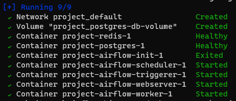

# Running Airflow Data pipeline - COVID-19 - Celery Executor

The project will include a scheduled data pipeline for transferring data from an API to Google BigQuery.

Link ref: <https://github.com/bardadon/covid_analysis>

```bash
docker compose up -d
```




Accessing the web interface
Once the cluster has started up, you can log in to the web interface and begin experimenting with DAGs.

The webserver is available at: <http://localhost:8080>. The default account has the login `airflow` and the password `airflow`

DAG Graph


DAG Gantt


## Cleaning-up the environment

The best way to do this is to:

- Run command in the directory you downloaded the docker-compose.yaml file

```bash
 docker compose down --volumes --remove-orphans 
```

- Remove the entire directory where you downloaded the docker-compose.yaml file

```bash
rm -rf '<DIRECTORY>'
```

- Run through this guide from the very beginning, starting by re-downloading the docker-compose.yaml file
